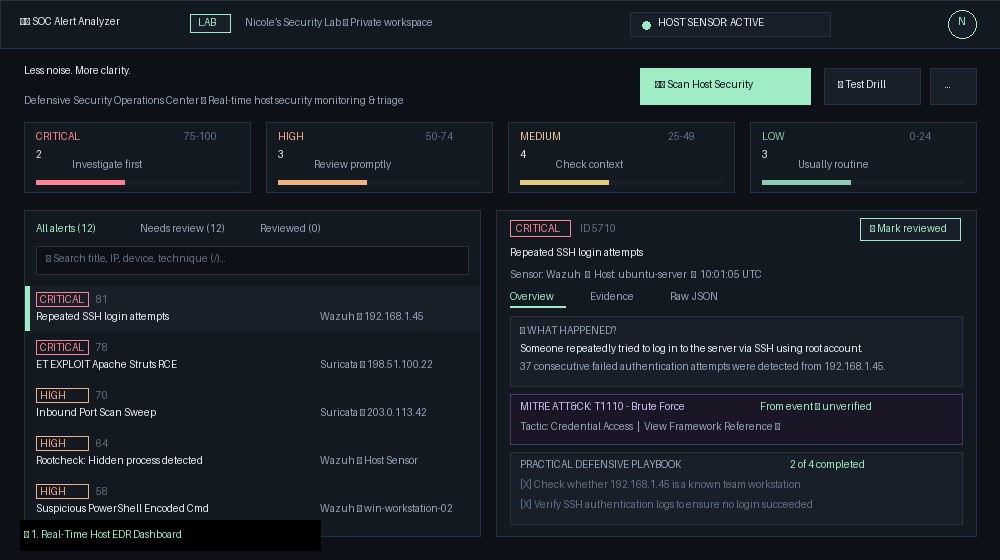

# SOC Alert Analyzer 🛡️

[](https://www.python.org/)
[](https://fastapi.tiangolo.com/)
[](https://docs.pytest.org/)
[](https://attack.mitre.org/)
[](docs/UI_UX_specification.md)
[](https://github.com/karayuuco/SOC_Alert_Analyzer/releases)
[](LICENSE)

> **Less noise. More clarity.**
> A defensive cybersecurity operations workbench and real-time host intrusion detection system (EDR-Lite) that transforms raw security telemetry and system anomalies into plain-language triage playbooks and MITRE ATT&CK® mappings.

---

## 🎬 10-Second Interactive Demo



---

## 🌟 Key Capabilities

* **Native Host Security Sensor (EDR-Lite)**:
  * **Process & LOLBin Auditing**: Detects processes running out of temporary folders (`Temp`, `AppData`), Living-off-the-Land Binaries (PowerShell `-enc`, `certutil -urlcache`, `vssadmin delete`, `bitsadmin`), process masquerading, and offensive tools (`mimikatz`, `chisel`, `nmap`).
  * **Network Sockets & Exposure Inspector**: Flags high-risk exposed listening ports on `0.0.0.0` (FTP 21, Telnet 23, Metasploit default 4444, Backdoors 1337, WinRM 5985, RDP 3389).
  * **Host Security Posture**: Evaluates Windows Firewall profile states and flags disabled defenses.
  * **OS Event Log Integration**: Directly inspects Windows Event Logs (Event IDs 4625, 4624, 4688, 7045, 4698, 4720, 1102) and Linux authentication logs.
* **Universal Multi-Source Telemetry Normalization**:
  * **Windows Event Logs (`.xml`, `.json`, `.txt`)**: Ingests Event Viewer exports and PowerShell `Get-WinEvent` streams.
  * **Web Server Access Logs (Apache / Nginx / IIS)**: Detects SQL Injection, XSS, Path Traversal, and web vulnerability scanners.
  * **Firewall & Network Logs**: Ingests Windows Firewall (`pfirewall.log`), Linux `iptables`/`ufw`, and pfSense logs.
  * **Enterprise SIEM/IDS Compatibility**: Full backward compatibility for Wazuh JSON and Suricata EVE JSON logs.
* **Explainable Priority Scoring (0–100 Demo Policy)**:
  * Wazuh rule level scaling: `round(rule.level / 16 × 85)`
  * Suricata baseline tiers: Severity 1 (70), Severity 2 (40), Severity 3+ (15)
  * Burst attempt count bonus: `+12` for $\ge 20$ repeated attempts
* **MITRE ATT&CK Enterprise Mapping**:
  * Maps detections directly to adversary techniques (`T1110` Brute Force, `T1059.001` PowerShell, `T1046` Network Service Discovery, `T1014` Rootkit, `T1190` Exploit Public-Facing App).
* **Beginner-Friendly Triage Playbooks**:
  * Answers *"What happened?"* and *"Why is this suspicious?"* before technical mechanics.
  * Practical investigation checklists with interactive step tracking and status persistence.
* **Real-Time WebSocket Threat Stream**:
  * Live bidirectional streaming over `/ws/threats` with instant UI updates and background heartbeat.
* **Zero-Setup Standalone Portability**:
  * Bundled into a single portable `SOC_Alert_Analyzer.exe` that runs on any Windows laptop without Python or dependencies.

---

## 🏗️ Architecture

```text
 ┌──────────────────────────────────────────────────────────────┐
 │                Protected Host System (Laptop)                 │
 │  ├── Active Processes (psutil)                               │
 │  ├── Open Listening Sockets (0.0.0.0)                         │
 │  ├── Windows Firewall Profiles                               │
 │  └── Windows Security Event Logs (4625, 4688, 7045)          │
 └──────────────────────────────┬───────────────────────────────┘
                                │ Live Telemetry
                                ▼
 ┌──────────────────────────────────────────────────────────────┐
 │                 FastAPI Core & REST Engine                   │
 │  ├── WebSocket Threat Stream (/ws/threats)                   │
 │  ├── Log Parsers (Windows, Wazuh, Suricata, Web, Firewall)   │
 │  ├── Alert Normalizer & Incident Correlator                  │
 │  └── Explainable Risk Scoring Engine (0-100)                 │
 └──────────────────────────────┬───────────────────────────────┘
                                │
                                ▼
 ┌──────────────────────────────────────────────────────────────┐
 │          Nicole’s Security Lab UI/UX Workbench               │
 │  ├── 4 Severity Overview Cards with Share Progress Bars      │
 │  ├── Real-Time Alert Queue (Search, Filters, Priority Sort)  │
 │  ├── Triage Playbook with Interactive Mitigation Checklists  │
 │  └── MITRE ATT&CK Framework References                       │
 └──────────────────────────────────────────────────────────────┘
```

---

## 🚀 Quickstart

### Option 1: Standalone Executable (Zero-Setup)

Download the latest release and run without installing Python:

1. Download **`SOC_Alert_Analyzer.exe`** from [Releases](https://github.com/karayuuco/SOC_Alert_Analyzer/releases).
2. Double-click the file. It will automatically:
   - Self-initialize a local SQLite database
   - Perform an initial baseline security audit of your laptop
   - Launch your default browser to `http://127.0.0.1:8000`

### Option 2: Run with Python

```powershell
# 1. Clone repository
git clone https://github.com/karayuuco/SOC_Alert_Analyzer.git
cd SOC_Alert_Analyzer

# 2. Install dependencies
pip install -r requirements.txt

# 3. Launch with one click
python launcher.py
```

### Option 3: Docker Compose

```powershell
docker compose up --build
```

---

## 🧪 Automated Testing

The project includes **34 automated pytest tests** covering API routes, the host sensor, log parsers, risk scoring, MITRE mappers, and incident correlation:

```powershell
python -m pytest -v
```

```text
tests/test_api.py::test_html_views PASSED
tests/test_api.py::test_upload_api_wazuh PASSED
tests/test_api.py::test_host_sensor_drill_api PASSED
tests/test_host_sensor.py::test_host_audit_processes PASSED
tests/test_mitre_mapper.py::test_mitre_mappings PASSED
tests/test_risk_engine.py::test_risk_scoring_bounds PASSED
============================= 34 passed in 3.08s =============================
```

---

## 📂 Repository Structure

```text
├── app/
│   ├── api/          # FastAPI REST endpoints & upload handlers
│   ├── database/     # SQLAlchemy connection & session management
│   ├── models/       # Alert and Incident ORM database models
│   ├── parsers/      # Windows Event, Wazuh, Suricata, Web, Linux parsers
│   ├── schemas/      # Pydantic request/response validation schemas
│   ├── security/     # Host sensor, risk engine, MITRE mapper, correlator
│   ├── static/       # CSS visual tokens (styles.css) and client app.js
│   └── templates/    # Jinja2 templates (dashboard, alerts, incidents)
├── docs/             # UI/UX specification, requirements, architecture
├── sample_data/      # Curated Wazuh, Suricata, and Linux attack samples
├── tests/            # Pytest test suite (34 automated tests)
├── launcher.py       # One-click browser & Uvicorn launcher
├── SOC_Alert_Analyzer.spec # PyInstaller standalone bundle configuration
└── README.md
```

---

## 🏷️ Repository Topics

`cybersecurity` • `soc-analyst` • `threat-detection` • `edr` • `siem` • `mitre-attack` • `fastapi` • `blue-team` • `incident-response` • `python`

---

## 📄 License

Distributed under the MIT License. See `LICENSE` for details.
