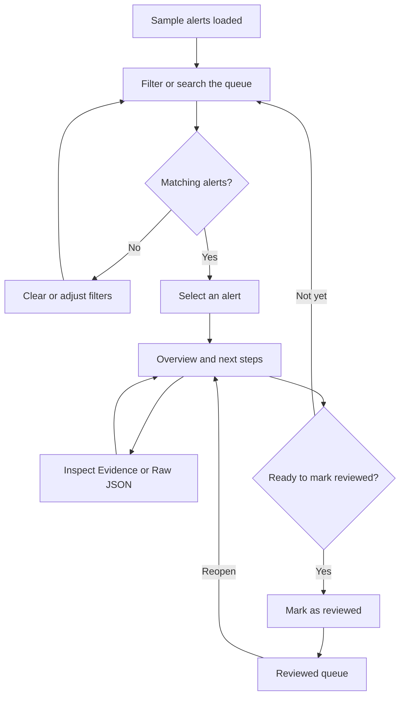

# SOC Alert Analyzer — UI & UX Document

| Item | Details |
|---|---|
| Project | SOC Alert Analyzer — Nicole’s Security Lab |
| Document version | 1.0 |

This document describes the existing prototype. Recommendations and proposed usability research are identified separately. It does not claim that user interviews, production security testing, or a formal accessibility audit have been completed.

## 1. Product purpose

SOC Alert Analyzer helps people with limited cybersecurity knowledge understand security alerts and decide what to investigate next. It converts representative Wazuh and Suricata records into one consistent interface.

The experience answers four questions:

- **What needs attention first?** Severity cards and a prioritized queue.
- **What happened?** A plain-language explanation and original evidence.
- **Which device or connection is involved?** Source, target/destination, and available device details.
- **What should I do next?** Practical investigation steps and a review checklist.

The prototype uses safe synthetic events. It demonstrates investigation without requiring live device access, executing commands, or blocking traffic.

## 2. Target users and their needs

These are design assumptions based on the project brief, rather than research findings.

| User group | Main need | Interface response |
|---|---|---|
| Individuals with little cybersecurity knowledge | Understand an alert without interpreting raw logs | Plain-language summaries, severity labels, and specific next steps |
| Cybersecurity students | Connect detections to evidence and attack techniques | Evidence tab, original JSON, and MITRE ATT&CK references |
| Portfolio reviewers | Quickly assess the project’s functionality and reasoning | Ready-to-use sample data, interactive filtering, and transparent scoring |

**Primary job to be done:** “When a security alert appears, help me understand its importance and check the relevant evidence so I can choose a sensible next step.”

## 3. UX principles

| Principle | Application |
|---|---|
| Explain before adding technical depth | Overview opens first; Evidence and Raw JSON are available on demand |
| Make priority understandable | Every alert has a severity label, score, and explainable scoring breakdown |
| Preserve investigation context | The queue and selected alert remain together on desktop |
| Communicate uncertainty | Copy distinguishes a detection from confirmed compromise |
| Support safe practice | Samples are labeled; review actions do not affect devices |
| Allow recovery | Filters can be cleared, reviewed alerts reopened, and the demo reset |
| Avoid relying on color alone | Severity also appears as text; cards include icons and numeric counts |

The intended tone is calm, direct, and helpful. Critical alerts receive visual emphasis without suggesting that a successful attack has been proven.

## 4. Information architecture

The site has one main page and two dialogs. It does not have separate dashboard, settings, account, or incident-management pages.

| Region | Main elements | Purpose |
|---|---|---|
| Header | Brand, LAB badge, private-workspace label, help button, Nicole’s initial | Establish identity and provide context |
| Introduction | “Less noise. More clarity.” and **Explore sample data** | Explain the benefit and offer a clear entry action |
| Data notice | Synthetic-data or locally parsed-data message | Explain what the user is viewing |
| Severity overview | Critical, High, Medium, Low cards; scoring-help link | Show dataset composition and filter by urgency |
| Investigation workspace | Alert queue and selected-alert panel | Support comparison and investigation |
| Footer | Portfolio attribution and **Reset demo** | Identify the project and restore the starting state |
| Alert Playground dialog | Sample choices, file input, JSON editor, parse action | Demonstrate data import and normalization |
| Help dialog | Scoring, mapping limitations, session behavior, references | Explain how to interpret the prototype |

The avatar is a visual identity marker, not an account menu. The header’s privacy label describes the configured workspace; the hosting platform enforces access.

## 5. Core user journeys

### 5.1 Investigate an alert

On a fresh session, the page loads 12 sample alerts, sorts them by highest priority, and selects the first alert automatically. The user can begin investigating immediately.

**Example:** Select **Critical**, open **Repeated SSH login attempts**, read the explanation, inspect the source IP and evidence, and check the suggested investigation steps. Mark it reviewed when the examination is complete.

### 5.2 Find a relevant connection or technique

Enter an IP address, alert phrase, device name, rule ID, or technique such as `T1110`. Results update immediately. Combine the search with a severity card, source dropdown, or review-status filter to narrow the queue further.

### 5.3 Parse sample or sanitized records

1. Open **Explore sample data**.
2. Choose **Mixed sample**, **Wazuh**, or **Suricata**, edit the JSON, or choose a sanitized file.
3. Select **Parse & investigate**.
4. On success, the dialog closes and the parsed dataset replaces the queue.
5. On failure, the dialog stays open, explains the issue, and preserves the current dataset.

Choosing a sample only fills the editor. The dataset changes when parsing succeeds.

## 6. Screen and component specifications

### 6.1 Severity overview

| Severity | Demo score range | Initial count | Guidance |
|---|---:|---:|---|
| Critical | 75–100 | 2 | Investigate first |
| High | 50–74 | 3 | Review promptly |
| Medium | 25–49 | 4 | Check the context |
| Low | 0–24 | 3 | Usually routine |

Each card displays a label, icon, count, score range, and guidance. A small bar represents that category’s share of the dataset; it is not a historical trend.

Card counts always describe the entire loaded dataset. Applying a search, source filter, or review filter does not change those counts. The queue separately shows how many records match.

### 6.2 Alert queue

| Element | Implemented behavior |
|---|---|
| Status filters | **All alerts**, **Needs review**, and **Reviewed**, each with a dataset-wide count |
| Search | Case-insensitive substring matching across title, description, source and target IPs, device, source tool, rule ID, and technique IDs/names |
| Source filter | All sources, Wazuh, or Suricata |
| Sorting | Highest priority by default; Newest first is also available |
| Result count | Shows matching records against the full dataset total |
| Alert row | Severity, title, source tool, device, UTC time, selection indicator, and a check mark when reviewed |
| Selected row | Mint left border and a tinted background |
| Clear filters | Clears severity, source, search, and review-status filters; preserves the sort choice |

Filters combine using **AND** logic. Priority sorting uses descending score, then newest timestamp for ties. The queue is scrollable, and long titles are shortened visually in the row while the detail panel shows the full title.

### 6.3 Alert details

The panel header shows severity, rule/signature ID, title, detection source, timestamp, and review status.

| Tab | Content |
|---|---|
| Overview | Plain-language meaning, priority score, source and target/destination, available MITRE mapping, and next-action checklist |
| Evidence | Recorded facts, original source severity, device/connection details, score calculation, and interpretation limitations |
| Raw JSON | Formatted original event and **Copy JSON** |

**Meaning before mechanics:** The explanation appears above technical details so a beginner can understand the situation before interpreting fields.

**Endpoint labels:** “Source” and “Target / destination” describe the record’s direction. They do not automatically mean attacker and victim. Missing fields are displayed as “Not recorded” or an equivalent explicit placeholder.

**MITRE mapping:** When supplied in the event, the interface shows the technique ID, name where known, tactic information where available, and a reference link. The label **From event · unverified** prevents the mapping from appearing to be an independently confirmed finding. If no mapping exists, the panel explains that absence.

**Review action:** **Mark as reviewed** becomes **Reopen alert** after use. Reviewing does not change severity or remove an alert from the overall dataset.

### 6.4 Alert Playground

The dialog supports a JSON array, a single JSON object, or JSONL. The file picker accepts `.json`, `.jsonl`, and `.ndjson`.

The interface advertises a limit of 1,000 records and 2 MB. The file chooser enforces a byte-size limit; pasted text is checked by string length in the current implementation. These checks can differ for non-ASCII text.

Successful imports report the parsed count, removed duplicates, and skipped non-alert Suricata events when applicable. Invalid records reject the import instead of silently removing evidence.

## 7. Interaction rules and UI states

| Trigger or state | Interface response |
|---|---|
| Click a severity card | Apply that severity; clicking the active card again clears it |
| Change filters | Keep the selected alert if it still matches; otherwise select the first matching alert and show Overview |
| No matching alerts | Show an empty queue message, a **Show all alerts** recovery action, and an empty detail panel |
| Select another alert | Show its Overview; at widths up to 850 px, scroll to the detail panel |
| Switch detail tabs | Retain the selected alert and change only its detail view |
| Check an action | Update the checked count; do not execute an action or automatically mark the alert reviewed |
| Mark reviewed while viewing Needs review | Remove it from that filtered queue and select the next match if available |
| Reopen while viewing Reviewed | Remove it from that filtered queue and restore Needs review status |
| Successful import | Replace the dataset; clear filters; restore Highest priority sorting and Overview |
| Invalid import | Keep the dialog and existing dataset; show an inline error |
| Copy unavailable | Show a message asking the user to select and copy the JSON manually |
| Reset demo | Restore all 12 samples, default filters/sort, and clear review marks and checked steps |

Success notifications appear near the bottom of the screen for approximately 4.2 seconds. Errors in the data editor remain visible until another relevant action clears them. Reset currently executes immediately without a confirmation or undo step.

## 8. Visual design system

### 8.1 Color palette

| Token / role | Hex value | Usage |
|---|---|---|
| Background | `#0D1117` | Main page |
| Surface | `#131920` | Cards and investigation panels |
| Secondary surface | `#181F28` | Supporting surfaces |
| Border | `#29313D` | Panel boundaries and separators |
| Main text | `#EAF0F6` | Headings and primary content |
| Muted text | `#98A4B5` | Supporting information |
| Primary accent | `#A0EDC5` | Main buttons, active controls, focus outlines |
| Critical | `#FF8393` | Critical labels and indicators |
| High | `#F5B17D` | High-priority labels and indicators |
| Medium | `#E4CB84` | Medium-priority labels and indicators |
| Low | `#8DCBB4` | Low-priority labels and indicators |

Dark surfaces provide a consistent security-dashboard appearance. Mint highlights indicate interaction and selection, while severity colors communicate priority. Purple-tinted mapping panels distinguish technique references from event facts and actions.

### 8.2 Typography and layout

| Element | Current specification |
|---|---|
| Font family | Inter if locally available, then system sans-serif fallbacks; no external font download |
| Technical text | System monospace for IPs, timestamps, rule IDs, and JSON |
| Main heading | Approximately 29–38 px, depending on viewport |
| Severity counts | Approximately 30–33 px |
| Detail heading | Approximately 19–24 px |
| Base body size | 14 px, with many component labels and descriptions using smaller sizes |
| Content width | Maximum 1,504 px, including horizontal padding |
| Desktop workspace | Two columns; queue slightly wider than details, approximately 1.28:1 |
| Panel radius | Usually 9–10 px; dialogs 12 px |
| Buttons and inputs | Usually 6–7 px corner radius |
| Icons | Consistent inline SVG line icons, generally 12–18 px |

Some metadata and badges use 7–11 px text. This is an existing readability limitation, particularly on small screens; it is not a recommended accessibility target.

## 9. Responsive behavior

| Width | Layout behavior |
|---|---|
| 1,500 px and wider | Larger heading, cards, and some row/detail text |
| 1,101–1,499 px | Four severity cards and a two-column investigation workspace |
| 851–1,100 px | Four cards; two investigation columns with tighter spacing |
| 541–850 px | Four cards; queue above details; selecting a row scrolls to its details |
| 540 px and narrower | Two-by-two severity grid, stacked hero content, compact controls, and vertical footer |

On narrow screens, secondary header and dataset labels are hidden to reduce crowding. This does not change access permissions. The queue uses an internal scroll area, while the detail panel follows below it in the page.

Desktop checks used a 1,440 × 1,080 viewport. Mobile checks used 390 × 844 and verified that the document had no horizontal overflow. These checks do not cover every screen size or browser.

## 10. Content and explanation guidelines

Descriptions should tell the user what was observed, why it might matter, what remains uncertain, and what to check next.

| Situation | Copy approach |
|---|---|
| Repeated failed logins | Explain attempted access and state that failed attempts do not prove someone got in |
| Suspicious PowerShell | Explain the Windows command tool and why context matters |
| Missing fields | State that the information was not recorded |
| Unknown custom detection | Preserve the original description and provide cautious general guidance |
| Review completion | Say “Reviewed”; do not imply “Resolved” or “Threat blocked” |

The current explanations are deterministic templates for the supplied demo signatures. They are not generated by an AI model. Other events receive general guidance rather than invented scenario details.

### Priority explanation

The 0–100 score is a disclosed demo policy, not a probability of compromise or an official vendor risk score.

| Source or condition | Calculation |
|---|---|
| Wazuh | `round(rule.level / 16 × 85)` |
| Suricata severity 1 | Base score 70 |
| Suricata severity 2 | Base score 40 |
| Suricata severity 3 or higher | Base score 15 |
| Custom Wazuh attempt count ≥20 | Add 12 |
| Final score | Capped at 100 |

The repeated-attempt field is the custom `data.attempt_count`, not Wazuh’s `rule.firedtimes`. The initial SSH sample scores 81: a base of 69 plus 12 for 37 attempts.

## 11. Accessibility

### Implemented support

- A **Skip to alerts** link.
- Semantic page regions and labeled controls.
- Visible keyboard focus outlines.
- Severity labels and counts in addition to color.
- Pressed-state information for selected filter buttons and alert rows.
- Detail tabs with selected-state information and Left/Right, Home, and End keyboard handling.
- The `/` shortcut focuses search when the user is not editing a field or inside a dialog.
- Native dialogs that can be dismissed with Escape.
- Polite announcements for result counts and notifications; alert semantics for import errors.
- Reduced-motion handling for transitions and mobile scrolling.

### Remaining assessment

The prototype has not undergone a full screen-reader, contrast, zoom/reflow, or cross-browser audit. Small labels and compact controls need particular attention. Automatic mobile scrolling also needs testing with assistive technology because scrolling alone does not move keyboard focus into the detail panel.

No WCAG conformance claim is made.

## 12. Privacy and state persistence

| Data or state | Current behavior |
|---|---|
| Built-in samples | Loaded when the page opens or the demo is reset |
| Imported alert records | Held in browser memory; refresh returns to the built-in dataset |
| Review marks and checked steps | Stored in the browser tab’s session storage; matching records can retain their marks after refresh |
| Search, filters, sorting, and selected tab | In-memory state; reset on refresh |
| Device actions | None; buttons only affect prototype state |
| Access restriction | Enforced by the hosting platform, configured as owner-only at deployment |

The application does not intentionally upload imported alert contents to a backend. Its alert-processing flow has no external AI call or telemetry integration. Opening an external reference link or using Copy JSON is an explicit user action.

Changing event content changes its identity for review tracking. Review marks are not a durable incident record or shared team workflow.

## 13. Validation completed

The following checks passed against the Version 1 application locally before deployment. Hosting separately confirmed successful private deployment. These are functional checks, not findings from participant usability research.

| Area | Verified coverage |
|---|---|
| Sample parsing | Both sources normalize into 12 alerts with counts of 2 Critical, 3 High, 4 Medium, and 3 Low |
| Prioritization | Severity boundaries, source severity direction, and the initial highest-priority alert |
| Investigation filters | Combined severity/source/search filtering, technique/IP matching, and empty results |
| Details | Selection updates Overview, Evidence, and Raw JSON correctly |
| Review workflow | Checklists, reviewed/reopened states, counts, and session persistence |
| Import handling | Sample parsing, JSONL file upload, invalid JSON rejection, deduplication, and non-alert event handling |
| Safe rendering | Imported HTML-like text displays as text; tested event-handler injection did not execute |
| Navigation | Detail-tab keyboard navigation and dialog dismissal |
| Responsive layout | Desktop and mobile interactions; no horizontal document overflow at the tested mobile width |
| Recovery | Reset returns the prototype to the initial dataset and clears practice progress |
| Runtime | No browser runtime errors during the tested interaction flow |

Seven automated parser/filter tests passed, alongside the browser interaction script. Clipboard success across browsers, a full accessibility audit, and every advertised import-size boundary were not comprehensively validated by that browser script.

## 14. Proposed usability evaluation

**Not yet conducted.** A small next study could involve five participants with basic computer knowledge and limited SOC experience.

| Task | What to observe |
|---|---|
| Identify the highest-priority alert | Whether the severity overview and initial ordering are understood |
| Find alerts for `203.0.113.42` | Whether search and result counts are discoverable |
| Explain the SSH alert in their own words | Whether they distinguish failed attempts from confirmed compromise |
| Find the source, destination, and next step | Whether the detail hierarchy supports investigation |
| Mark reviewed, then reopen | Whether review status is understood as workflow rather than remediation |
| Correct malformed JSON | Whether the error message supports recovery without losing the existing dataset |

Suggested evaluation targets are at least four of five participants completing the main investigation without assistance and all participants understanding that review marks do not block threats. Record completion time, confusion points, and a short confidence rating; do not present targets as achieved results.

## 15. Recommended next improvements

These items are proposals, not existing capabilities.

| Priority | Improvement | User benefit |
|---|---|---|
| High | Increase small metadata/body text and review compact touch targets | Improve reading and interaction on mobile |
| High | Complete contrast, screen-reader, zoom, and keyboard-focus testing | Identify barriers beyond the current functional checks |
| High | Recalculate scenario evidence from edited fields or fall back to general guidance | Avoid stale template details when a user substantially edits a demo event |
| Medium | Add an undo option or confirmation for Reset demo | Reduce accidental loss of practice progress |
| Medium | Add **Back to alert list** after mobile investigation | Make repeated investigation easier on a long page |
| Medium | Show a concise post-import summary, including skipped and duplicate counts | Make import outcomes easier to review after the toast disappears |
| Medium | Explain and unify pasted-text and file byte limits | Make import limits consistent for all text |
| Later | Add investigation notes and explicit export | Support portfolio demonstrations with a reusable investigation record |

Live monitoring, automated response, team collaboration, and AI-generated explanations remain outside this prototype’s scope.

## 16. Source references

This specification was checked against the deployed Version 1 source at commit `7951e8ceb2cad8c86396e430597b3522c3c8606d`:

- `public/index.html` — page structure and dialogs.
- `public/styles.css` — visual tokens, component styling, and breakpoints.
- `public/app.js` — UI state, filtering controls, detail views, and session behavior.
- `public/parser.js` — validation, normalization, prioritization, and explanation selection.
- `public/samples.js` — synthetic scenarios and starting dataset.
- `tests/parser.test.mjs` and `tests/browser.mjs` — automated validation coverage.

The site’s Help dialog also links to Wazuh documentation, Suricata EVE documentation, and MITRE ATT&CK for technical background.
