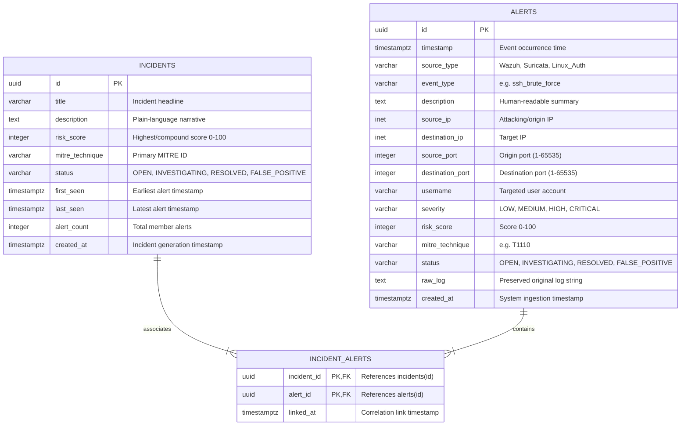

# Database Design Document
## SOC Alert Analyzer

---

## 1. Database Overview

### 1.1 Purpose
This document provides the architectural and physical database design for the **SOC Alert Analyzer** platform. It defines the schemas, entity relationships, constraints, indexing strategies, and data access models required to support multi-source log ingestion, canonical normalization, risk scoring, MITRE ATT&CK association, and incident correlation.

### 1.2 Technology Selection & Rationale
- **Database Management System (DBMS)**: **PostgreSQL 15+**
  - **Relational Integrity**: Strong foreign key relationships and ACID compliance guarantee that alerts and correlated incidents remain consistently mapped without orphan references.
  - **Network & JSON Types**: Native support for IP addresses (`INET`), variable text, and JSON structures (`JSONB`) accommodates diverse log payloads and raw audit logs.
  - **Time-Series Capabilities**: High-performance B-tree indexing on timestamp columns enables sub-second time-window queries during correlation and dashboard rendering.
- **ORM / Abstraction**: **SQLAlchemy 2.0 (Python)** with **Pydantic v2** validation.
- **Migration Framework**: **Alembic** for version-controlled schema evolution.

---

## 2. Conceptual Data Model

The system organizes security telemetry into three core relational entities:
1. **`Alert`**: An individual normalized security event parsed from Wazuh, Suricata, or Linux authentication logs.
2. **`Incident`**: An aggregated security case synthesizing multiple related alerts sharing temporal and contextual proximity (e.g., identical attacker IP and event type).
3. **`IncidentAlert`**: An associative junction entity establishing a Many-to-Many ($M:N$) relationship between incidents and individual alerts.



---

## 3. Logical Data Model & Data Dictionary

### 3.1 Enumerations & Domain Constraints

#### `source_type_enum`
- `WAZUH`: Security alert originating from Wazuh HIDS/SIEM JSON logs.
- `SURICATA`: Network intrusion detection event originating from Suricata EVE JSON.
- `LINUX_AUTH`: Host-level authentication event parsed from `/var/log/auth.log`.

#### `severity_level_enum`
- `LOW`: Informational or benign anomaly (Risk score: 0–24).
- `MEDIUM`: Suspicious policy deviation or anomalous activity (Risk score: 25–49).
- `HIGH`: Active probing, brute force, or probable exploitation (Risk score: 50–74).
- `CRITICAL`: High-confidence compromise, privilege escalation, or malware (Risk score: 75–100).

#### `alert_status_enum`
- `OPEN`: Newly ingested, awaiting review.
- `INVESTIGATING`: Under active triage by the user or analyst.
- `RESOLVED`: Threat mitigated or verified harmless.
- `FALSE_POSITIVE`: Benign administrative or expected activity.

---

### 3.2 Table: `alerts`
Stores canonical, normalized security events.

| Column Name | Data Type | Nullable | Default | Constraints / Validation | Description |
| :--- | :--- | :---: | :---: | :--- | :--- |
| `id` | `UUID` | No | `gen_random_uuid()` | Primary Key | Globally unique alert identifier. |
| `timestamp` | `TIMESTAMPTZ` | No | — | `NOT NULL` | The exact time the event occurred in UTC. |
| `source_type` | `VARCHAR(32)` | No | — | `NOT NULL` | Log source (`WAZUH`, `SURICATA`, `LINUX_AUTH`). |
| `event_type` | `VARCHAR(64)` | No | — | `NOT NULL` | Normalized classification (e.g., `ssh_auth_fail`). |
| `description` | `TEXT` | No | — | `NOT NULL` | Plain-language description of the alert. |
| `source_ip` | `INET` | Yes | `NULL` | Valid IP format | IP address of the attacking or source host. |
| `destination_ip` | `INET` | Yes | `NULL` | Valid IP format | IP address of the targeted victim host. |
| `source_port` | `INTEGER` | Yes | `NULL` | `CHECK (source_port BETWEEN 1 AND 65535)` | Source network port. |
| `destination_port` | `INTEGER` | Yes | `NULL` | `CHECK (destination_port BETWEEN 1 AND 65535)` | Destination network port. |
| `username` | `VARCHAR(128)` | Yes | `NULL` | — | Target or executing account name. |
| `severity` | `VARCHAR(16)` | No | `'MEDIUM'` | `IN ('LOW', 'MEDIUM', 'HIGH', 'CRITICAL')` | Qualitative risk tier. |
| `risk_score` | `INTEGER` | No | `0` | `CHECK (risk_score BETWEEN 0 AND 100)` | Quantitative threat score. |
| `mitre_technique` | `VARCHAR(32)` | Yes | `NULL` | Format `T[0-9]{4}(\.[0-9]{3})?` | MITRE ATT&CK technique reference ID. |
| `status` | `VARCHAR(32)` | No | `'OPEN'` | `IN ('OPEN', 'INVESTIGATING', 'RESOLVED', 'FALSE_POSITIVE')` | Investigation lifecycle state. |
| `raw_log` | `TEXT` | Yes | `NULL` | — | Original raw log string for forensic verification. |
| `created_at` | `TIMESTAMPTZ` | No | `CURRENT_TIMESTAMP` | `NOT NULL` | Time record was saved to the database. |

---

### 3.3 Table: `incidents`
Stores aggregated threat cases synthesized by the correlation engine.

| Column Name | Data Type | Nullable | Default | Constraints / Validation | Description |
| :--- | :--- | :---: | :---: | :--- | :--- |
| `id` | `UUID` | No | `gen_random_uuid()` | Primary Key | Unique incident case identifier. |
| `title` | `VARCHAR(255)` | No | — | `NOT NULL` | High-level threat title (e.g., "SSH Brute Force Campaign"). |
| `description` | `TEXT` | No | — | `NOT NULL` | Plain-language summary of the incident. |
| `risk_score` | `INTEGER` | No | `0` | `CHECK (risk_score BETWEEN 0 AND 100)` | Aggregated maximum incident risk. |
| `mitre_technique` | `VARCHAR(32)` | Yes | `NULL` | — | Primary MITRE ATT&CK technique ID. |
| `status` | `VARCHAR(32)` | No | `'OPEN'` | `IN ('OPEN', 'INVESTIGATING', 'RESOLVED', 'FALSE_POSITIVE')` | Overall incident triage state. |
| `first_seen` | `TIMESTAMPTZ` | No | — | `NOT NULL` | Earliest alert timestamp in this incident group. |
| `last_seen` | `TIMESTAMPTZ` | No | — | `NOT NULL` | Most recent alert timestamp in this incident group. |
| `alert_count` | `INTEGER` | No | `1` | `CHECK (alert_count >= 1)` | Total count of aggregated alerts. |
| `created_at` | `TIMESTAMPTZ` | No | `CURRENT_TIMESTAMP` | `NOT NULL` | Creation timestamp in database. |

---

### 3.4 Table: `incident_alerts` (Junction Table)
Establishes referential associations between incidents and their member alerts.

| Column Name | Data Type | Nullable | Default | Constraints / Validation | Description |
| :--- | :--- | :---: | :---: | :--- | :--- |
| `incident_id` | `UUID` | No | — | Foreign Key → `incidents(id)` ON DELETE CASCADE | Associated incident ID. |
| `alert_id` | `UUID` | No | — | Foreign Key → `alerts(id)` ON DELETE CASCADE | Associated alert ID. |
| `linked_at` | `TIMESTAMPTZ` | No | `CURRENT_TIMESTAMP` | `NOT NULL` | Timestamp when correlation linked the entities. |

- **Primary Key**: Composite `(incident_id, alert_id)` to prevent duplicate association.

---

## 4. Physical Data Model & DDL Specifications

```sql
-- ==========================================================
-- SOC Alert Analyzer - PostgreSQL Schema DDL
-- Version: 1.0 (MVP)
-- ==========================================================

-- 1. Enable UUID Extension
CREATE EXTENSION IF NOT EXISTS "uuid-ossp";
CREATE EXTENSION IF NOT EXISTS "pgcrypto";

-- 2. Create Alerts Table
CREATE TABLE alerts (
    id UUID PRIMARY KEY DEFAULT gen_random_uuid(),
    timestamp TIMESTAMPTZ NOT NULL,
    source_type VARCHAR(32) NOT NULL,
    event_type VARCHAR(64) NOT NULL,
    description TEXT NOT NULL,
    source_ip INET NULL,
    destination_ip INET NULL,
    source_port INTEGER NULL CHECK (source_port BETWEEN 1 AND 65535),
    destination_port INTEGER NULL CHECK (destination_port BETWEEN 1 AND 65535),
    username VARCHAR(128) NULL,
    severity VARCHAR(16) NOT NULL DEFAULT 'MEDIUM' CHECK (severity IN ('LOW', 'MEDIUM', 'HIGH', 'CRITICAL')),
    risk_score INTEGER NOT NULL DEFAULT 0 CHECK (risk_score BETWEEN 0 AND 100),
    mitre_technique VARCHAR(32) NULL,
    status VARCHAR(32) NOT NULL DEFAULT 'OPEN' CHECK (status IN ('OPEN', 'INVESTIGATING', 'RESOLVED', 'FALSE_POSITIVE')),
    raw_log TEXT NULL,
    created_at TIMESTAMPTZ NOT NULL DEFAULT CURRENT_TIMESTAMP
);

-- 3. Create Incidents Table
CREATE TABLE incidents (
    id UUID PRIMARY KEY DEFAULT gen_random_uuid(),
    title VARCHAR(255) NOT NULL,
    description TEXT NOT NULL,
    risk_score INTEGER NOT NULL DEFAULT 0 CHECK (risk_score BETWEEN 0 AND 100),
    mitre_technique VARCHAR(32) NULL,
    status VARCHAR(32) NOT NULL DEFAULT 'OPEN' CHECK (status IN ('OPEN', 'INVESTIGATING', 'RESOLVED', 'FALSE_POSITIVE')),
    first_seen TIMESTAMPTZ NOT NULL,
    last_seen TIMESTAMPTZ NOT NULL,
    alert_count INTEGER NOT NULL DEFAULT 1 CHECK (alert_count >= 1),
    created_at TIMESTAMPTZ NOT NULL DEFAULT CURRENT_TIMESTAMP
);

-- 4. Create Incident Alerts Junction Table
CREATE TABLE incident_alerts (
    incident_id UUID NOT NULL REFERENCES incidents(id) ON DELETE CASCADE,
    alert_id UUID NOT NULL REFERENCES alerts(id) ON DELETE CASCADE,
    linked_at TIMESTAMPTZ NOT NULL DEFAULT CURRENT_TIMESTAMP,
    PRIMARY KEY (incident_id, alert_id)
);
```

---

## 5. Indexing & Query Optimization Strategy

Efficient log analysis relies heavily on low-latency queries during correlation and dashboard aggregation.

```sql
-- B-Tree Index for Time-Series Queries and Sorting
CREATE INDEX idx_alerts_timestamp ON alerts (timestamp DESC);

-- B-Tree Indexes for Dashboard Filtering
CREATE INDEX idx_alerts_severity ON alerts (severity);
CREATE INDEX idx_alerts_status ON alerts (status);
CREATE INDEX idx_alerts_risk_score ON alerts (risk_score DESC);
CREATE INDEX idx_alerts_mitre ON alerts (mitre_technique);

-- Composite Index for Incident Correlation Lookups
-- Enables rapid temporal grouping by Attacker IP + Victim IP + Event Type
CREATE INDEX idx_alerts_correlation ON alerts (source_ip, destination_ip, event_type, timestamp);

-- Index on Junction Table for fast incident detail retrieval
CREATE INDEX idx_incident_alerts_alert_id ON incident_alerts (alert_id);
CREATE INDEX idx_incidents_status_risk ON incidents (status, risk_score DESC);
```

### Query Execution Analysis
1. **Dashboard KPI Aggregation**:
   ```sql
   SELECT severity, COUNT(*) FROM alerts GROUP BY severity;
   ```
   *Plan*: Index-only scan on `idx_alerts_severity`.
2. **5-Minute Correlation Window Query**:
   ```sql
   SELECT id, timestamp, risk_score FROM alerts
   WHERE source_ip = '192.168.1.45'
     AND destination_ip = '192.168.1.10'
     AND event_type = 'ssh_auth_fail'
     AND timestamp BETWEEN '2026-09-10 10:00:00Z' AND '2026-09-10 10:05:00Z';
   ```
   *Plan*: Composite index scan utilizing `idx_alerts_correlation`.

---

## 6. SQLAlchemy 2.0 Declarative Models

The Python ORM implementation matching this schema:

```python
import uuid
from datetime import datetime
from typing import List, Optional
from sqlalchemy import (
    String, Integer, Text, DateTime, ForeignKey, CheckConstraint, Index
)
from sqlalchemy.dialects.postgresql import UUID, INET
from sqlalchemy.orm import DeclarativeBase, Mapped, mapped_column, relationship

class Base(DeclarativeBase):
    pass

class IncidentAlert(Base):
    __tablename__ = "incident_alerts"

    incident_id: Mapped[uuid.UUID] = mapped_column(
        UUID(as_uuid=True), ForeignKey("incidents.id", ondelete="CASCADE"), primary_key=True
    )
    alert_id: Mapped[uuid.UUID] = mapped_column(
        UUID(as_uuid=True), ForeignKey("alerts.id", ondelete="CASCADE"), primary_key=True
    )
    linked_at: Mapped[datetime] = mapped_column(DateTime(timezone=True), default=datetime.utcnow)

class Alert(Base):
    __tablename__ = "alerts"

    id: Mapped[uuid.UUID] = mapped_column(
        UUID(as_uuid=True), primary_key=True, default=uuid.uuid4
    )
    timestamp: Mapped[datetime] = mapped_column(DateTime(timezone=True), nullable=False, index=True)
    source_type: Mapped[str] = mapped_column(String(32), nullable=False)
    event_type: Mapped[str] = mapped_column(String(64), nullable=False)
    description: Mapped[str] = mapped_column(Text, nullable=False)
    source_ip: Mapped[Optional[str]] = mapped_column(INET, nullable=True)
    destination_ip: Mapped[Optional[str]] = mapped_column(INET, nullable=True)
    source_port: Mapped[Optional[int]] = mapped_column(Integer, nullable=True)
    destination_port: Mapped[Optional[int]] = mapped_column(Integer, nullable=True)
    username: Mapped[Optional[str]] = mapped_column(String(128), nullable=True)
    severity: Mapped[str] = mapped_column(String(16), default="MEDIUM", index=True)
    risk_score: Mapped[int] = mapped_column(Integer, default=0, index=True)
    mitre_technique: Mapped[Optional[str]] = mapped_column(String(32), nullable=True, index=True)
    status: Mapped[str] = mapped_column(String(32), default="OPEN", index=True)
    raw_log: Mapped[Optional[str]] = mapped_column(Text, nullable=True)
    created_at: Mapped[datetime] = mapped_column(DateTime(timezone=True), default=datetime.utcnow)

    # Relationships
    incidents: Mapped[List["Incident"]] = relationship(
        secondary="incident_alerts", back_populates="alerts"
    )

    __table_args__ = (
        CheckConstraint("risk_score BETWEEN 0 AND 100", name="chk_alert_risk_score"),
        Index("idx_alerts_correlation", "source_ip", "destination_ip", "event_type", "timestamp"),
    )

class Incident(Base):
    __tablename__ = "incidents"

    id: Mapped[uuid.UUID] = mapped_column(
        UUID(as_uuid=True), primary_key=True, default=uuid.uuid4
    )
    title: Mapped[str] = mapped_column(String(255), nullable=False)
    description: Mapped[str] = mapped_column(Text, nullable=False)
    risk_score: Mapped[int] = mapped_column(Integer, default=0, index=True)
    mitre_technique: Mapped[Optional[str]] = mapped_column(String(32), nullable=True)
    status: Mapped[str] = mapped_column(String(32), default="OPEN", index=True)
    first_seen: Mapped[datetime] = mapped_column(DateTime(timezone=True), nullable=False)
    last_seen: Mapped[datetime] = mapped_column(DateTime(timezone=True), nullable=False)
    alert_count: Mapped[int] = mapped_column(Integer, default=1)
    created_at: Mapped[datetime] = mapped_column(DateTime(timezone=True), default=datetime.utcnow)

    # Relationships
    alerts: Mapped[List[Alert]] = relationship(
        secondary="incident_alerts", back_populates="incidents"
    )
```

---

## 7. Data Lifecycle & Scalability Considerations

1. **Volume Management**: For MVP, log volumes are constrained to file uploads ($<50$ MB per batch). For future V2 scaling with continuous live streaming, the `alerts` table is pre-structured to support PostgreSQL declarative range partitioning by month on the `timestamp` column:
   ```sql
   -- Future V2 Partitioning Strategy
   -- CREATE TABLE alerts_v2 (...) PARTITION BY RANGE (timestamp);
   -- CREATE TABLE alerts_2026_09 PARTITION OF alerts_v2 FOR VALUES FROM ('2026-09-01') TO ('2026-10-01');
   ```
2. **Referential Cascading**: When an incident is deleted or unbundled, only the associations in `incident_alerts` are removed; individual normalized alerts are preserved in `alerts` to maintain an immutable audit trail.
3. **Database Seeding**: An automated seed script (`sample_data/seed.py`) populates representative incidents (brute force, port scan, suspicious script execution) to enable instantaneous testing and UI evaluation upon container launch.
