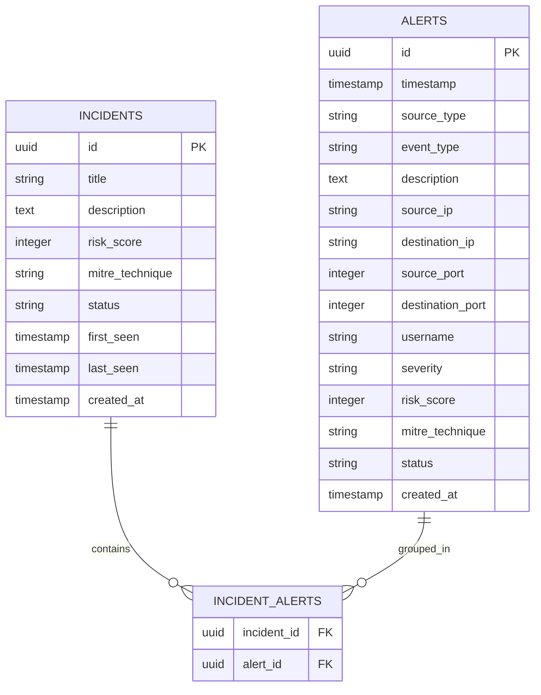
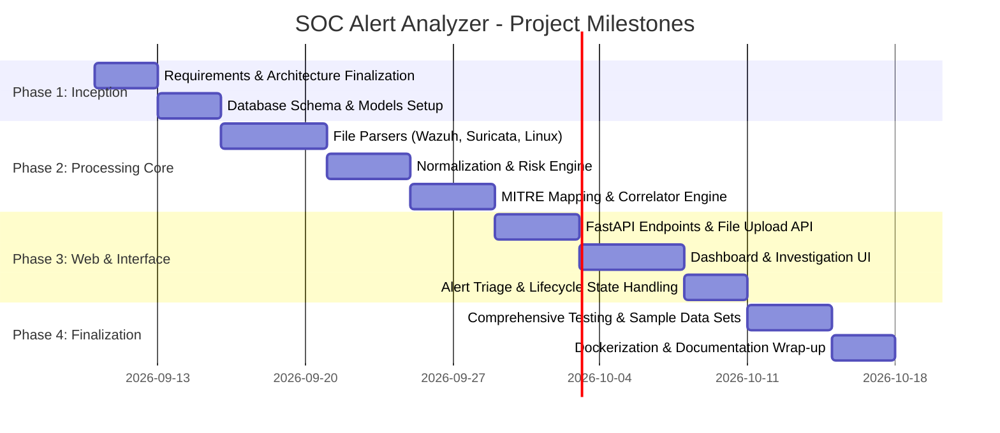

# Project Charter: SOC Alert Analyzer

---

## 1. Document Control

| Attribute | Details |
| :--- | :--- |
| **Project Name** | SOC Alert Analyzer |
| **Project Code** | SOC-AA |
| **Version** | 1.0 |
| **Status** | Approved / Baseline |
| **Document Owner** | Cybersecurity Project Lead / Siam BSc IT |
| **Creation Date** | September 10, 2026 |
| **Target Completion** | MVP Milestone (Phase 1) |

---

## 2. Executive Summary & Purpose

The **SOC Alert Analyzer** is a defensive cybersecurity web application engineered to bridge the gap between complex security monitoring tools and users with limited cybersecurity expertise. 

Traditional intrusion detection systems (IDS) and Security Information and Event Management (SIEM) platforms—such as Wazuh and Suricata—generate voluminous, technical alerts packed with cryptic rule IDs, raw logs, and severity codes. For non-expert system owners and junior analysts, interpreting whether an alert signifies an active breach or benign telemetry is a formidable challenge.

The primary mission of the SOC Alert Analyzer is:
> **To transform complex security alerts into simple, understandable, and actionable information, empowering non-expert users to understand what happened, determine the severity, and execute decisive remediation steps without needing to interpret raw logs.**

---

## 3. Problem Statement & Business Case

### 3.1 Problem Statement
Modern cyber defense tools produce highly technical notifications (e.g., Wazuh Rule 5710, Level 10, `event: authentication_failed`). Non-technical users, small business operators, and beginner security students lack the specialized knowledge to evaluate:
- What the alert actually means in plain terms.
- Whether their system is actively compromised.
- The origin and identity of the threat actor or device.
- Which specific remediation steps must be executed immediately.
- Whether the alert represents an isolated event or a coordinated attack campaign.

### 3.2 Value Proposition
By ingesting raw alerts, normalizing disparate data models, applying transparent risk scoring, mapping tactics to the industry-standard **MITRE ATT&CK** framework, correlating related events, and presenting a plain-language investigation workflow, SOC Alert Analyzer democratizes defensive threat awareness.

---

## 4. Target Audience & Stakeholder Profiles

| User Category | Description | Primary Needs / Pain Points |
| :--- | :--- | :--- |
| **Primary User** | Device owners and individuals with basic computing skills but limited cybersecurity knowledge | Needs plain-language explanations, clear threat severity (Low/Medium/High/Critical), and guided checklist actions without jargon. |
| **Secondary User** | Cybersecurity students and junior SOC analysts | Seeks a streamlined investigation interface that correlates events, links to MITRE ATT&CK techniques, and reinforces analytical triage workflows. |
| **Project Sponsor / Evaluators** | Academic evaluators and security industry recruiters | Evaluates practical defensive security principles, log parsing, correlation algorithms, web architecture, and clean code practices. |

---

## 5. Project Objectives (SMART)

1. **Multi-Source Ingestion**: Ingest and parse security event files from at least three disparate sources (**Wazuh JSON**, **Suricata EVE JSON**, and **Linux Auth Logs**) with 100% schema normalization.
2. **Unified Risk Engine**: Implement an explainable, rule-based scoring engine that standardizes event risk on a 0–100 scale and maps scores to four intuitive tiers (Low, Medium, High, Critical).
3. **MITRE ATT&CK Contextualization**: Automatically cross-reference identified signatures to established MITRE ATT&CK techniques (e.g., T1110 for Brute Force, T1046 for Network Service Discovery).
4. **Automated Incident Correlation**: Group isolated, related alerts (based on identical source/destination entities, event types, and temporal proximity) into cohesive incident cases to mitigate alert fatigue.
5. **Beginner-Friendly Triage UX**: Provide a dedicated investigation view offering plain-English explanations ("What happened?", "Why is this suspicious?") alongside actionable remediation checklists.
6. **Containerized Portability**: Package the complete application stack (Backend, Database, and Web UI) into Docker and Docker Compose for single-command deployment.

---

## 6. Project Scope

### 6.1 In-Scope (Phase 1: Minimum Viable Product - MVP)

```
┌────────────────────────────────────────────────────────────────────────┐
│                              MVP SCOPE                                 │
│                                                                        │
│  [File Upload] ──> [Parser Engine] ──> [Unified Normalizer]            │
│                            │                                           │
│                            ▼                                           │
│                   [Risk Scoring Engine]                                │
│                            │                                           │
│                            ▼                                           │
│                    [MITRE ATT&CK Mapper]                               │
│                            │                                           │
│                            ▼                                           │
│                   [Correlation Engine]                                 │
│                            │                                           │
│                            ▼                                           │
│              [Dashboard & Investigation UI]                            │
│                            │                                           │
│                            ▼                                           │
│                 [Status Lifecycle Triage]                              │
└────────────────────────────────────────────────────────────────────────┘
```

The MVP focuses specifically on the end-to-end defensive workflow:
- **Alert Import Module**: File-based upload for Wazuh JSON alerts, Suricata EVE JSON logs, and Linux `/var/log/auth.log` format files.
- **Alert Normalization Layer**: Conversion of ingested log structures into a standardized data model (`Alert` schema).
- **Rule-Based Risk Engine**: Multi-factor scoring formula incorporating base severity, event repetition, attack confidence, and asset context.
- **MITRE ATT&CK Mapping**: Curated local lookup repository mapping events to MITRE technique IDs and tactic designations.
- **Heuristic Correlator**: Time-window aggregation grouping repeated alerts sharing source IP, target IP, and threat signatures into unified `Incidents`.
- **User-Centric Investigation View**: Plain-text breakdown of attack mechanics and specific defensive remediation recommendations.
- **Alert Lifecycle Management**: State progression tracking (`OPEN` → `INVESTIGATING` → `RESOLVED`, plus `FALSE POSITIVE`).
- **SOC Overview Dashboard**: Metric cards (Critical, High, Medium, Low), incident status tallies, recent alert streams, and severity charts.

### 6.2 Out-of-Scope (Deferred to Future Phases / V2+)

To ensure project completion and high-quality core functionality, the following features are explicitly excluded from the MVP:
- Real-time network daemon listeners / live Wazuh agent socket connections.
- Real-time Suricata UNIX socket/packet capture streaming.
- External threat intelligence API integration (VirusTotal, AbuseIPDB, Shodan).
- GeoIP database integration and interactive world mapping.
- Automated active response / firewall rule orchestration (e.g., automated `iptables` IP blocking).
- External notification webhooks (Email, SMS, Discord, Telegram).
- Windows Event Log (`.evtx`) parsing.
- Machine-learning anomaly detection or unsupervised clustering.
- Enterprise Multi-Tenancy and Role-Based Access Control (RBAC).
- Third-party LLM integrations for dynamic text generation.

---

## 7. Technical Architecture & Technology Stack

### 7.1 System Architecture

```text
┌───────────────────────────────────────────────────────────────┐
│                     PRESENTATION LAYER                        │
│         Jinja2 Templates / HTML5 / CSS3 / JavaScript          │
│          (Dashboard, Alert Explorer, Investigation View)      │
└───────────────────────────────┬───────────────────────────────┘
                                │ HTTP / JSON
                                ▼
┌───────────────────────────────────────────────────────────────┐
│                      APPLICATION LAYER                        │
│                           FastAPI                             │
│                  REST API Endpoints & Routes                  │
├───────────────────────────────────────────────────────────────┤
│                     SECURITY CORE ENGINE                      │
│  ┌──────────────┐   ┌──────────────┐   ┌───────────────────┐  │
│  │ File Parsers │──>│  Normalizer  │──>│    Risk Engine    │  │
│  └──────────────┘   └──────────────┘   └───────────────────┘  │
│                                                  │            │
│  ┌──────────────┐                      ┌─────────▼─────────┐  │
│  │  Correlator  │<─────────────────────│   MITRE Mapper    │  │
│  └──────────────┘                      └───────────────────┘  │
└───────────────────────────────┬───────────────────────────────┘
                                │ SQLAlchemy ORM
                                ▼
┌───────────────────────────────────────────────────────────────┐
│                       PERSISTENCE LAYER                       │
│                          PostgreSQL                           │
│        Tables: alerts, incidents, incident_alerts             │
└───────────────────────────────────────────────────────────────┘
```

### 7.2 Technology Stack

| Layer | Technology | Selection Rationale |
| :--- | :--- | :--- |
| **Backend Framework** | Python 3.11+, FastAPI, Pydantic | High performance, native asynchronous capabilities, automatic data validation, and built-in OpenAPI documentation. |
| **Persistence / ORM** | PostgreSQL, SQLAlchemy 2.0 | Robust relational integrity, powerful indexing for time-series logs, and flexible JSON querying. |
| **Frontend / UI** | Jinja2, HTML5, CSS3, Modern JS | Server-rendered simplicity for the MVP, eliminating heavy SPA build pipelines while delivering high responsiveness. |
| **Containerization** | Docker, Docker Compose | Consistent local development and reproducible evaluation environments. |
| **Testing** | Pytest, HTTPX | Rigorous unit test coverage for normalization logic, risk scoring mathematics, and API contract testing. |

---

## 8. Data Architecture & Schema Overview

### 8.1 Normalized Entities



### 8.2 Risk Scoring Rubric

| Risk Score | Threat Level | Visual Indicator | Action Timeline |
| :---: | :---: | :---: | :--- |
| **75 – 100** | CRITICAL | 🔴 Red | Immediate investigation required; high potential of system compromise. |
| **50 – 74** | HIGH | 🟠 Orange | Prompt analysis needed; active probing or suspicious exploitation detected. |
| **25 – 49** | MEDIUM | 🟡 Yellow | Routine review; anomalous behavior or minor security policy deviation. |
| **0 – 24** | LOW | 🟢 Green | Informational event; normal background activity or benign anomaly. |

---

## 9. Project Milestones & Implementation Roadmap



### Milestone Breakdown

| Milestone ID | Deliverable | Key Outputs |
| :--- | :--- | :--- |
| **M1: Core Foundation** | Data model & project scaffolding | Directory structure, requirements, database migrations, base models (`Alert`, `Incident`). |
| **M2: Security Engine** | Parsers & normalization | Wazuh, Suricata, and Linux auth parsers; MITRE lookup table; risk scoring engine; correlation engine. |
| **M3: API & Web UI** | REST API & Dashboard | Ingestion endpoints, query filters, dashboard summary cards, investigation templates. |
| **M4: Lifecycle & Actions** | Triage & action engine | Status transition logic (`OPEN` → `RESOLVED`), plain-English explanation generator, action checklists. |
| **M5: Deployment & Release** | Verification & containerization | Sample data library, pytest suite (>80% coverage), `docker-compose.yml`, release documentation. |

---

## 10. Risk Management Plan

| Risk Description | Severity | Likelihood | Mitigation Strategy |
| :--- | :---: | :---: | :--- |
| **Inconsistent log schemas across varying tool versions** | High | Medium | Define strict Pydantic schemas with fallback fields and graceful degradation for unrecognized metadata. |
| **Alert storming causing memory degradation during upload** | Medium | Medium | Enforce streaming file chunking and batch database insertions; impose reasonable file size limits for the MVP. |
| **Heuristic correlation over-grouping unrelated events** | Medium | Low | Restrict correlation to narrow time windows (e.g., 5–10 minutes) and require matching source IP and target signatures. |
| **Explanations remaining too technical for target users** | High | Low | Create predefined, validated plain-language explanation templates tied directly to signature classifications. |
| **Database connection bottlenecks under load** | Low | Low | Utilize SQLAlchemy connection pooling with async session management. |

---

## 11. Success Criteria & UX Acceptance Checklist

The project will be deemed successful when the system satisfies the following user acceptance criteria:

- [ ] **Ingestion Capability**: Successfully uploads and parses sample Wazuh JSON, Suricata EVE JSON, and Linux authentication logs.
- [ ] **Normalization Fidelity**: Normalizes 100% of valid test logs into the standardized internal Alert schema.
- [ ] **Risk Transparency**: Accurately computes a 0–100 risk score with clear visual badge indicators.
- [ ] **MITRE Alignment**: Successfully maps identified threat signatures to MITRE ATT&CK technique IDs.
- [ ] **Effective Correlation**: Groups burst/repetitive alerts (e.g., 30+ failed SSH attempts) into a single incident object.
- [ ] **Actionable Investigation**: The investigation view provides direct answers to:
  - *What happened?*
  - *Why is this suspicious?*
  - *Where did it come from?*
  - *What should I do?*
- [ ] **Triage Workflow**: Enables users to transition alerts through the complete lifecycle (`OPEN` to `RESOLVED`).
- [ ] **Zero-Jargon Verdict**: A non-technical user can accurately explain the threat and identify required remediation without examining raw log syntax.

---

## 12. Project Governance & Sign-Off

### Project Roles & Responsibilities
- **Project Lead / Cybersecurity Analyst**: System design, threat classification rules, MITRE mappings, remediation guidelines.
- **Backend Engineer**: FastAPI application architecture, parser implementations, database persistence, risk engine algorithms.
- **Frontend / UX Engineer**: Jinja2 templates, dashboard visuals, plain-language triage workflows.
- **QA & Security Tester**: Synthetic log generation, correlation verification, and end-to-end user acceptance testing.

### Approval Sign-Off

| Stakeholder Role | Name / Title | Signature | Date |
| :--- | :--- | :--- | :--- |
| **Project Lead** | Lead Developer | *Approved* | 2026-09-10 |
| **Academic Supervisor** | Cybersecurity Faculty Advisor | *Pending Review* | — |
| **Technical Reviewer** | Senior SOC Analyst | *Pending Review* | — |
